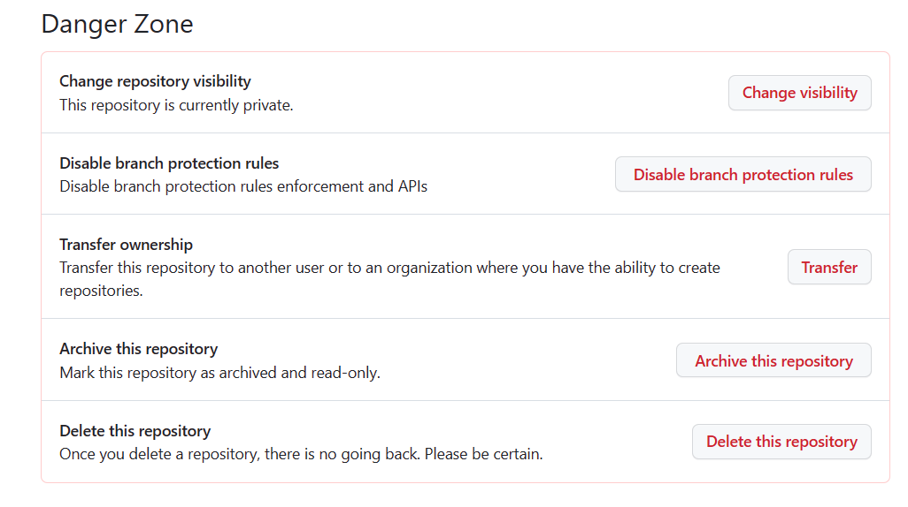

# Github PrivateとPublicを切り替える方法

## PriveteをPublicに切り替える方法

1. 変更するリポジトリを開く
2. setingを開く
3. 画面の下の方にある、**Danger Zone**の**Change repository visibility**から**Change visibility**をクリック
4. **change privete**または**Change public**をクリック
5. あとは何とかなる

